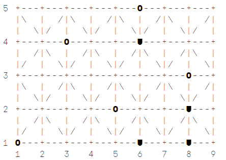

# **Collapse_5**

## **Identification of the Game and Group**

This project focuses on implementing the **Collapse** board game, an abstract strategy game that challenges players with tactical and strategic decision-making. 

| **Group**    | **Class** | **Student Number** | **Full Name**                 | **Contribution (%)** | **Tasks Performed**                                                                                     |
|--------------|-----------|---------------------|-------------------------------|-----------------------|---------------------------------------------------------------------------------------------------------|
| Collapse_5   | T01       | up202208028         | Alexandre Gonçalves Ramos    | 50                    | Finalized the game logic, enhanced the board display and input system, and refined the rule integration. |
| Collapse_5   | T01       | up202208115         | Francisco Miguel Pires Afonso| 50                    | Developed the initial game logic, implemented AI decision-making, and designed the rule selection system.|

The project was developed collaboratively, with both members contributing equally to its success. Francisco initiated the core game logic and laid the foundation for the AI mechanics, while Alexandre built upon this groundwork by refining and completing the game logic. Additionally, Alexandre focused on improving the board display and input handling for smoother gameplay, while Francisco worked on the rule implementation and AI decision-making.

Throughout the development process, both members actively reviewed and understood each other's contributions, ensuring a comprehensive understanding of the entire codebase. This collaborative approach allowed both members to ensure the quality and coherence of the final implementation.


## **Installation and Execution**

To correctly install and execute the game, follow these steps:

### **Prerequisites**
- **SICStus Prolog 4.9** must be installed.
- The `font.ttf` file can be installed for optimal visual representation.

### **Installing the Font**

The game includes a custom font (`font.ttf`) for improved visual appeal. Follow these steps to install the font on your system:

#### **On Linux**:
1. Copy the `font.ttf` file to your system's fonts directory:
   ```bash
   cp PFL_TP2_T01_Collapse_5/font.ttf ~/.fonts/
   ```
2. Update the font cache:
   ```bash
   fc-cache -f -v
   ```
3. The font is now available for use.

#### **On Windows**:
1. Navigate to the folder where the `PFL_TP2_T01_Collapse_5` project was extracted.
2. Locate the `font.ttf` file.
3. Right-click on the file and select **Install**.
4. The font will now be available system-wide.

---

### **Installation Steps for Linux**

1. Extract the ZIP file containing the project:
   ```bash
   unzip PFL_TP2_T01_Collapse_5.zip
   ```
2. Navigate to the `src` folder:
   ```bash
   cd PFL_TP2_T01_Collapse_5/src
   ```
3. Start SICStus Prolog by typing:
   ```bash
   sicstus
   ```
4. Load the main file:
   ```prolog
   [game].
   ```
5. If the main menu does not open automatically, start the game using:
   ```prolog
   play.
   ```

### **Installation Steps for Windows**

1. Extract the ZIP file containing the project to a folder, such as `PFL_TP2_T01_Collapse_5`.
2. Open the **SICStus Prolog** application.
3. Navigate to the `src` folder in SICStus and consult the `game.pl` file. 
4. If the main menu does not load automatically, use the command:
   ```prolog
   play.
   ```

**With these steps, both the font and the game will be properly installed and executed on your system.**

---

## **Description of the Game**

**Collapse** is a strategic two-player board game where the primary objective is to outmaneuver your opponent by capturing their pieces or forcing them into a position where they cannot make a valid move. The game is played on a **9x5 grid board**, traditionally associated with the Fanorona board design, and involves capturing opponent pieces through collisions.

### **Game Rules**

1. **Setup**:
   - The game starts with pieces placed around the perimeter of a 9x5 board.
   - Players decide if they want to play first (**white**) or second (**black**).
   - In **Player vs Bot** mode, the player always plays first (white), while in **Bot vs Player** mode, the player takes the second turn (black).

2. **Movement**:
   - A piece can move in one of eight directions: north, south, east, west, northeast, northwest, southeast, or southwest.
   - Movement rules depend on the active **rule**:
     - **Normal Rule**: Diagonal moves are only allowed on cells where the sum of row and column coordinates is even (as per Fanorona board design).
     - **Easy Rule**: Diagonal moves are allowed on all cells.

3. **Capturing**:
   - A move is valid only if it results in the capture of exactly one opponent piece.
   - The piece moves in a straight line along the grid until it collides with an opponent's piece.
   - Capturing rules:
     - The move must result in the capture of one opponent piece.
     - The piece cannot change direction during the move.
     - The piece cannot move in a direction where there is no opponent piece to collide with.
   - Captured pieces are removed from the board immediately.

4. **Gameplay**:
   - Players alternate turns, making one valid move per turn.
   - A player must choose a move that results in the capture of an opponent's piece.

5. **Game End**:
   - The game ends when a player is unable to make a valid move on their turn.
   - This includes scenarios where all of a player's pieces have been captured.
   - The remaining player is declared the winner.

### **Game Objective**

The main objective is to strategically position your pieces while capturing your opponent's. Players must also anticipate their opponent's moves to avoid being left without a valid capture.

### **Links for Reference**
  - [Official Collapse Information from Kanare Abstract](https://kanare-abstract.com/en/pages/collapse)
  - [PDF of Rules (from Kanare Kato)](https://cdn.shopify.com/s/files/1/0578/3502/8664/files/Collapse_EN.pdf?v=1713463846)
  - [Fanorona Board Information](https://en.wikipedia.org/wiki/Fanorona)

---

## **Considerations for Game Extensions**  

During the development of **Collapse**, we explored various ways to provide flexibility and adaptability in gameplay. This led to the implementation of **optional rules**, allowing players to choose the complexity of the game while maintaining its essence.  

### **1. Normal Rule**  
In the standard mode, diagonal moves are restricted to cells where the sum of the coordinates `(X + Y)` is an even number. This restriction reflects the design of the Fanorona board, where diagonal connections are valid only in specific positions. This rule challenges players to plan their moves strategically while working within these constraints, adding depth and complexity to the gameplay.  

### **2. Easy Rule**  
Initially, the game was developed using what is now called the "easy rule," allowing diagonal moves on any cell regardless of the coordinate parity. However, during the evaluation of potential extensions, we discovered that this rule was inconsistent with the Fanorona board's standard design. Despite this realization, the easy rule was retained as a beginner-friendly option, providing a simpler and more accessible gameplay experience for novice players.  

### **Variable Board Sizes**  
The possibility of introducing variable board sizes was considered but deemed unnecessary. The fixed 9x5 board size ensures a pre-defined arrangement of pieces, central to the game's strategy. Expanding the board size would require significant adjustments to the initial setup and could distort the gameplay, moving away from the original intent of the game.  

By addressing these considerations, we aimed to make **Collapse** both engaging for experienced players and approachable for those new to the game.

---

## **Game Logic**

The implementation of **Collapse** in Prolog reflects careful design decisions to ensure a robust and user-friendly gaming experience. The following subsections describe the representation and handling of game configuration, game state, move representation, and user interaction.

### **Game Configuration Representation**
The game configuration represents the setup information necessary to initialize the game. It includes the following details:
- **Player Types**: Indicates whether each player is a human or a computer/bot (e.g., `human`, `computer(Level)`).
- **Game Rule**: Specifies whether the game uses the **Normal Rule** (restricted diagonals) or **Easy Rule** (diagonals allowed anywhere).

Internally, this configuration is stored as a list:
```prolog
[Player1Type, Player2Type, Rule]
```
For example:
- `human vs human` with the Normal Rule: `[human, human, 1]`
- `human vs computer` with Easy Rule: `[human, computer(2), 2]`

The `initial_state/2` predicate uses this configuration to initialize the game state, including setting up the board, assigning the first player (`player1`), and applying the selected rule.

---

### **Internal Game State Representation**
The game state represents all necessary information to track the current status of the game. It is stored in the structure:
```prolog
game_state(Board, CurrentPlayer, Rule)
```
- **Board**: A 2D list representing the 9x5 grid. Each cell is an atom (`black`, `white`, or `empty`) indicating the piece or its absence.
  - Example of the initial board:
    ```prolog
    [
        [black, white, black, white, black, white, black, white, black],
        [white, empty, empty, empty, empty, empty, empty, empty, white],
        [empty, empty, empty, empty, empty, empty, empty, empty, empty],
        [black, empty, empty, empty, empty, empty, empty, empty, black],
        [white, black, white, black, white, black, white, black, white]
    ]
    ```
- **CurrentPlayer**: Indicates the current player (`player1` or `player2`).
- **Rule**: Specifies the active rule (e.g., `1` for Normal Rule or `2` for Easy Rule).

**Examples**:
- **Initial State**:
   ```prolog
   game_state(Board, player1, 1)
   ```

  

---

- **Intermediate State**:
   After a few moves, the board and current player might look like:

   ```prolog
   game_state(Board, player2, 1)
   ```

  

---

- **Final State**:
   When a player cannot make a valid move, game over and the other player is declared as the winner.

   ```prolog
   game_over(game_state(Board, player2, 1), player1)
   ```

   

---

### **Move Representation**
Moves in **Collapse** are represented as:
```prolog
move(Row, Col, Dir)
```
- **Row**: The row number of the piece being moved (1-5).
- **Col**: The column number of the piece being moved (1-9).
- **Dir**: The direction of movement (`north`, `south`, `east`, `west`, `northeast`, `northwest`, `southeast`, `southwest`).

The `move/3` predicate uses this representation to:
1. Validate the move using `valid_moves/2`.
2. Update the board by removing the piece from its original position, capturing the opponent's piece, and placing the player's piece in its final position.
3. Switch to the next player.

For example:
- A move from the piece in row 3, column 5, in the north direction:
  ```prolog
  move(3, 5, north)
  ```

---

### **User Interaction**
The game features a structured menu system and user-friendly interaction methods to guide players through their choices and gameplay.

#### **Menu System**:
The menu is implemented using `display_main_menu/3`, which allows players to:
1. Choose the game mode (e.g., `Player vs Player`, `Player vs Bot`).
2. Select the rule set (`Normal` or `Easy`).
3. Set the computer/bot difficulty level when applicable (`Level 1` or `Level 2`).

#### **Input Validation**:
Player input is validated to ensure it respects the game's rules and format:
- **Move Input**: Players are prompted to input a move in the format:
  ```prolog
  move(row, col, dir).
  ```
  - Validation ensures the move exists in the list of valid moves (`valid_moves/2`).
  - Invalid inputs prompt the player to try again.

- **Menu Input**: Menu options are validated using Prolog's `member/2` predicate. Invalid options are rejected with a prompt to re-enter a valid choice.

#### **Error Handling**:
The program uses a combination of recursive calls and `repeat` loops to manage invalid input gracefully:
- Incorrect menu selections lead to a re-prompt for valid input.
- Invalid moves in the game prompt the player to try again without disrupting gameplay.

---

## **Conclusions**

The development of **Collapse** has been a rewarding and challenging process that allowed us to improve our Prolog programming skills and abstract strategy game mechanics. 
The project successfully captures the essence of the game **Collapse**, with a clear implementation of its rules and mechanics.

### **Achievements**
1. **Rule Customization**: The implementation of both the **Normal Rule** and the **Easy Rule** offers flexibility for players of different skill levels.
2. **AI Implementation**: Two levels of AI (random and strategic greedy) provide challenging gameplay for solo players while showing effective use of Prolog's capabilities.
3. **Dynamic Game Flow**: The integration of robust input validation and a structured menu system ensures a seamless user experience.
4. **Visual Appeal**: The inclusion of custom fonts and board styling enhances the aesthetic appeal of the game.

### **Limitations**
1. **Fixed Board Size**: The game is limited to the 9x5 board configuration given the size is integral to the game's balance.
2. **AI Complexity**: While the Level 2 AI employs strategic decision-making, it does not incorporate level 3 AI.
3. **User Interface**: The game is text-based, which might players who are accustomed to graphical user interfaces.

### **Future Improvements**
1. **Enhanced AI**: Developing a more advanced AI with predictive capabilities and heuristics could improve the challenge for experienced players.
2. **Graphical Interface**: Adding a GUI would make the game more accessible to a larger audience and improve user engagement.
3. **Rule Customization**: Allowing players to define their own rules could make the game even more versatile and appealing to different audiences.
4. **Game Analytics**: Introducing gameplay statistics (e.g., move history, win rates) could provide players with insights and improve their experience.

---

## **Bibliography**

During the development of **Collapse**, we consulted several resources to ensure the implementation was similar to the original game while using good programming practices. Below is a list of the references used:

### **Moodle Resources**

Used Prolog Lectures Slides available on PFL Moodle in order to implement good programming practices across the project.

### **Wikipedia Resources**
- **Fanorona Board Design**: Information about the Fanorona board was referenced to ensure accurate adaptation of diagonal move restrictions.  
  - [Fanorona Wikipedia Page](https://en.wikipedia.org/wiki/Fanorona)

### **Web Resources**
- **Collapse Game Rules**: Official information for the game mechanics and rules.  
  - [Kanare Abstract - Official Collapse Page](https://kanare-abstract.com/en/pages/collapse)
  - [PDF of Rules (from Kanare Abstract)](https://cdn.shopify.com/s/files/1/0578/3502/8664/files/Collapse_EN.pdf?v=1713463846)  

### **Tools and AI Assistance**
- **ChatGPT (OpenAI)**: Assisted with AI programming logic and suggestions for future improvements for our developed game.
  - **Queries Used**:
    - "Suggest future improvements for our game."
    - "Suggest improvements for the level 2 AI bot."


